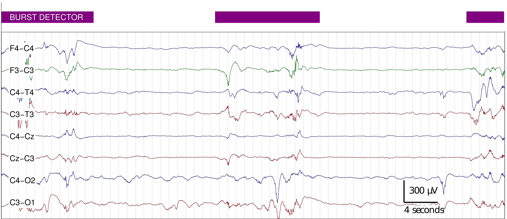
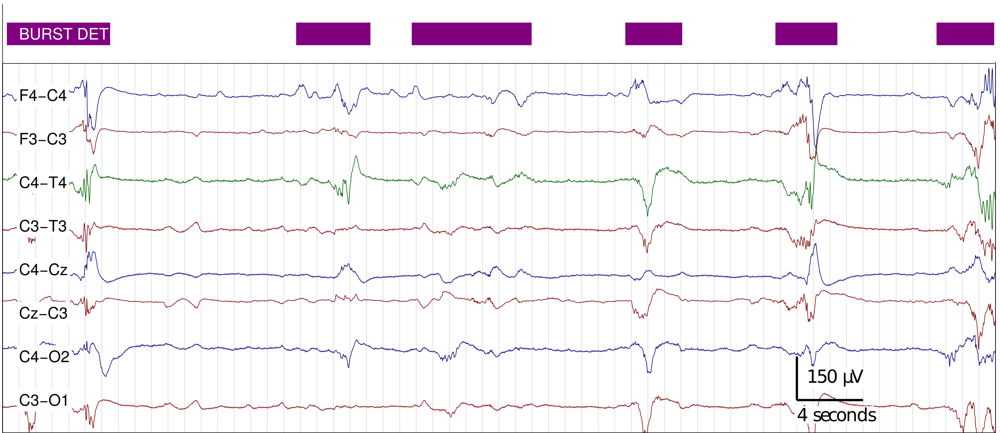
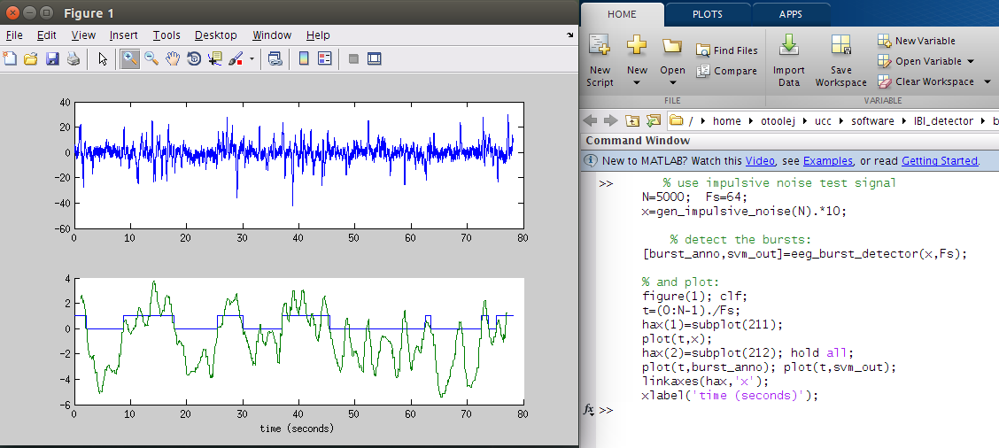

Burst Detector for Preterm EEG
==============================

Collection of M-files (computer code) to implement a method to detect bursts on EEG
recordings, as described in [[1]](#references). Detector uses a linear combination of
multiple amplitude and spectral features.  Developed and tested on EEG recordings from
premature infants (<30 weeks gestational age) using a bipolar EEG montgage (F3-C3, F4-C4,
C3-O1, C4-O2, C3-T3, C4-T4, Cz-C3, and C4-Cz). Detector operates on 1 channel only.
Requires Matlab or Octave programming environments. Updates can be found
at [github](https://github.com/otoolej/burst_detector).

To cite this software, please use reference [[1]](#references). 

__Update (Nov. 2019): Python version of this code at:
https://github.com/otoolej/py_burst_detector __

[](https://zenodo.org/badge/latestdoi/42042482)

# contents
* [overview](#overview)
* [quick start](#quick-start)
* [example](#example)
* [requirements](#requirements)
* [test computer setup](#test-computer-setup)
* [licence](#licence)
* [references](#references)
* [contact](#contact)


# overview



A simple method to detect bursts in the EEG of preterm infants. The method was developed
by assessing multiple frequency and amplitude features of bursts. Selected features were combined in
a classifier (support vector machine). After a feature selection and training procedure,
the detector consisted of eight features which are combined in a linear support vector
machine. The code here implements this detector, which was trained on annotations from
1-channel of 10 minute EEG recordings from 36 preterm infants.




# quick start
Set paths in Matlab/Octave, or do so using the `load_curdir` function:
```matlab
  >> load_curdir;
```


# example
```matlab
      % use impulsive noise test signal
      N=5000;  Fs=64; 
      x=gen_impulsive_noise(N).*10;
      
	  % detect the bursts:
      [burst_anno,svm_out]=eeg_burst_detector(x,Fs);

      % and plot:
      figure(1); clf; 
      t=(0:N-1)./Fs;
      hax(1)=subplot(211); hold all;
      plot(t,burst_anno); plot(t,svm_out);
      hax(2)=subplot(212); 
      plot(t,x);
      linkaxes(hax,'x');
      xlabel('time (seconds)');
```



# files
All Matlab files (.m files) have a description and an example in the header. To read this
header, type `help <filename.m>` in Matlab.  Directory structure is as follows: 
```
├── bd_parameters.m               # parameters for the method are defined here
├── eeg_burst_detector.m          # burst detector for multi-channel EEG
├── estimate_features
│   ├── edo.m                       # envelope--derivative operator
│   ├── env.m                       # signal envelope (using Hilber transform)
│   ├── fd.m                        # fractal dimension (using Higuichi method)
│   ├── if_.m                       # instantaneous frequency (using CFD estimate)
│   ├── psd_r2.m                    # fit of linear regression to log-log spectrum
│   └── rel_spec_power.m            # relative spectral power
├── gen_features.m                  # generate features
├── load_curdir.m                   # load the path
└── utils
    ├── do_bandpass_filtering.m     # bandpass filtering (IIR filter)
    ├── epoch_window.m              # epoch window size and hop lengths
    ├── get_window.m                # generate epoch window
    └── gen_impulsive_noise.m       # impulsive noise
```


# requirements
Either Matlab (R2013 or
newer, [Mathworks website](http://www.mathworks.co.uk/products/matlab/)) with the Signal
Processing Toolbox or Octave (v3.8 or
newer, [Octave website](http://www.gnu.org/software/octave/index.html)) with the
'octave-signal' add-on package.


# test computer setup
- hardware:  Intel(R) Xeon(R) CPU E5-1603 0 @ 2.80GHz; 8GB memory.
- operating system: Ubuntu GNU/Linux x86_64 distribution (16.10, Yakkety Yak), with Linux
  kernel 4.8.0-41-generic.
- software: Octave (4.0.3) with 'octave-signal' toolbox and Matlab (R2013a) with Signal
  Processing Toolbox.

---

# licence

```
Copyright (c) 2015, John M. O' Toole, University College Cork
All rights reserved.

Redistribution and use in source and binary forms, with or without modification,
are permitted provided that the following conditions are met:

  Redistributions of source code must retain the above copyright notice, this
  list of conditions and the following disclaimer.

  Redistributions in binary form must reproduce the above copyright notice, this
  list of conditions and the following disclaimer in the documentation and/or
  other materials provided with the distribution.

  Neither the name of the University College Cork nor the names of its
  contributors may be used to endorse or promote products derived from
  this software without specific prior written permission.

THIS SOFTWARE IS PROVIDED BY THE COPYRIGHT HOLDERS AND CONTRIBUTORS "AS IS" AND
ANY EXPRESS OR IMPLIED WARRANTIES, INCLUDING, BUT NOT LIMITED TO, THE IMPLIED
WARRANTIES OF MERCHANTABILITY AND FITNESS FOR A PARTICULAR PURPOSE ARE
DISCLAIMED. IN NO EVENT SHALL THE COPYRIGHT HOLDER OR CONTRIBUTORS BE LIABLE FOR
ANY DIRECT, INDIRECT, INCIDENTAL, SPECIAL, EXEMPLARY, OR CONSEQUENTIAL DAMAGES
(INCLUDING, BUT NOT LIMITED TO, PROCUREMENT OF SUBSTITUTE GOODS OR SERVICES;
LOSS OF USE, DATA, OR PROFITS; OR BUSINESS INTERRUPTION) HOWEVER CAUSED AND ON
ANY THEORY OF LIABILITY, WHETHER IN CONTRACT, STRICT LIABILITY, OR TORT
(INCLUDING NEGLIGENCE OR OTHERWISE) ARISING IN ANY WAY OUT OF THE USE OF THIS
SOFTWARE, EVEN IF ADVISED OF THE POSSIBILITY OF SUCH DAMAGE.
```


# references

1. JM O' Toole, GB Boylan, RO Lloyd, RM Goulding, S Vanhatalo, and NJ Stevenson,
“Detecting Bursts in the EEG of Very and Extremely Premature Infants Using a Multi-Feature
Approach”, Medical Engineering & Physics, vol. 45, pp. 42-50, 2017. 
[DOI:10.1016/j.medengphy.2017.04.003](https://doi.org/10.1016/j.medengphy.2017.04.003)
(Version of code to accompany paper: [](https://zenodo.org/badge/latestdoi/42042482))


2. JM O' Toole and NJ Stevenson, “Assessing instantaneous energy in the EEG: a
non-negative, frequency-weighted energy operator”, In 36th Annual International Conference
of the IEEE Engineering in Medicine and Biology Society (EMBC), pp. 3288-3291, 2014. 
{ [paper](http://otoolej.github.io/pubs/PDFs/JMOToole_energy_EMBC14.pdf) |
  [poster](http://otoolej.github.io/pubs/PDFs/EMBC_poster_Aug2014_NLEO.pdf) |
  [code](http://otoolej.github.io/code/nleo/) }


---

# contact

John M. O' Toole

Neonatal Brain Research Group,  
Irish Centre for Fetal and Neonatal Translational Research ([INFANT](http://www.infantcentre.ie/)),  
Department of Paediatrics and Child Health,  
University College Cork,  
Cork University Hospital, Room 2.19 Paediatrics Building,  
Cork, Ireland


